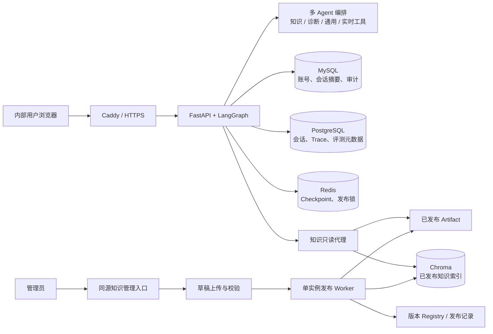

# Metro Agent

[](https://github.com/aa540285528-alt/metro_agent/actions/workflows/ci.yml)
[](LICENSE)

## 项目定位

Metro Agent 是面向**地铁通信运维**场景的私有化多 Agent 知识助手。它将受治理的 RAG、多 Agent 编排、实时工具、会话历史与离线评测整合为一套适合小范围内部使用的系统。

项目服务于单组织的内部运维人员，适合小规模试点（例如 15 人以内）。它的重点不是做一个通用“超级 Agent”，而是让运维知识能够被安全地上传、校验、发布、查询、回滚和审计。

公开仓库仅包含源码、合成样例、确定性测试和部署配置；不包含生产密钥、真实运维记录、用户会话数据或真实知识索引。

## 项目交付边界与当前质量

当前交付定位是**单组织私有化内部试点**，不是通用 SaaS，也不宣称已经达到正式生产交付标准。

- 支持管理员预置账号、普通用户查询、知识上传与版本化发布；不支持自注册、SSO、LDAP、OAuth 或密码找回。
- 支持 Docker Compose、Caddy HTTPS、健康检查、数据库迁移、备份恢复和镜像回滚；多副本场景尚需把登录限流改为 Redis 等共享原子限流器。
- 普通用户只能查询已发布知识；管理员可以创建草稿、查看校验结果、显式发布和回滚历史版本。
- 应用当前使用同步 Agent 执行；执行中的模型或工具调用尚不能因用户被禁用而协作取消。

真实 Agent 验收中，路径与安全指标达到当前门槛；语义指标仍未通过：`answer_relevance=0.8635`、`answer_accuracy=0.7235`，均低于 `0.9`。因此当前版本**不算模型质量验收通过**，不得描述为“模型质量已达标”。

GitHub Actions 会执行 Ruff 检查、离线测试、Docker 镜像构建、MySQL 集成测试和 Gitleaks 密钥扫描。离线验证命令如下：

```bash
python -m pytest -m "not live and not integration" -q
```

## 核心能力

- **多 Agent 协作**：提供通用、诊断、知识和实时工具 Agent，并记录会话历史、本地 Trace 与评测元数据。
- **受治理知识库**：知识包先进入草稿，再经历校验、显式发布、版本记录和可审计回滚；草稿不会直接进入线上检索库。
- **最小权限账号体系**：无自注册；管理员可创建或禁用用户、调整角色、重置密码，管理动作写入审计记录。
- **服务端数据隔离**：身份从 Cookie 解析，客户端无法通过提交 `user_id` 改变业务数据、会话、Checkpoint 或长期记忆归属。
- **读写路径隔离**：Web 应用不持有 Docker socket、shell 权限或 Chroma 写权限；发布 Worker 才负责 artifact 与知识索引写入。
- **可运维部署**：通过 Caddy 终结 TLS；MySQL、PostgreSQL、Redis、Chroma 与发布 Worker 不直接暴露到公网。

## 系统架构



应用只通过知识只读代理查询当前已发布版本。管理员操作先生成受控任务，发布 Worker 在 Redis 发布锁下校验、构建并原子切换版本指针；失败、锁冲突或重启都不得覆盖当前已发布版本。

| 存储 | 职责与隔离边界 |
|---|---|
| MySQL `metro_auth` | 用户、Argon2id 密码哈希、会话摘要与身份审计；与业务数据物理分库。 |
| PostgreSQL `metro_agent` | 会话历史、Agent Trace、工具调用、Token/时延和评测元数据。 |
| Redis | LangGraph Checkpoint 与知识发布锁；不是身份真源，也不保存密码。 |
| Chroma `chroma_db` | 当前已发布知识的检索索引。 |
| Chroma `memory_chroma_db` | 按 `auth:<id>` 隔离的用户长期记忆。 |

## 部署步骤

### 1. 准备部署环境

准备 Docker Engine、Docker Compose v2、Caddy 和一台仅向受控内部网络开放 HTTPS 的服务器。部署配置只使用一个独立 `.env`，例如 `D:\MetroAgent\pilot\.env`；不要使用源码根目录、worktree 或其他环境的 `.env`。

从 `.env.example` 创建该文件，并为 `POSTGRES_PASSWORD`、`AUTH_MYSQL_PASSWORD`、`MYSQL_ROOT_PASSWORD` 设置互不重复的高熵值；为 `AUTH_SESSION_PEPPER` 设置至少 32 字节随机值。`MODEL_DIR` 必须指向同时包含 `bge-m3/` 与 `bge-reranker/` 的宿主机模型目录。`.env` 不得提交、打印或写入日志。

### 2. 渲染并启动服务

在仓库根目录执行：

```powershell
$envFile = "D:\MetroAgent\pilot\.env"
docker compose --env-file $envFile --project-name metro-agent-pilot config --quiet
docker compose --env-file $envFile --project-name metro-agent-pilot --profile knowledge-admin up --build -d
docker compose --env-file $envFile --project-name metro-agent-pilot ps -a
pwsh -File deploy/operations/verify-deployment.ps1 -EnvFile $envFile -ProjectName metro-agent-pilot
```

`db-migrate` 与 `auth-migrate` 必须以退出码 `0` 结束。`/api/health` 表示应用进程存活；`/api/ready` 只有在存在非空的已发布知识版本时才表示可接收知识问答流量。

### 3. 创建首个管理员

首次部署时执行一次：

```powershell
docker compose --env-file $envFile --project-name metro-agent-pilot run --rm app python -m metro_agent.auth.bootstrap_admin --username admin
```

密码不会作为命令行参数保存。后续由管理员通过同源管理界面创建普通用户或其他管理员。

### 4. 配置 HTTPS 与访问边界

将 `.env` 中的 `AUTH_COOKIE_SECURE=true`，并设置非秘密的 `PILOT_FQDN` 与 `APP_HOST_PORT`。使用 [`deploy/proxy/Caddyfile.example`](deploy/proxy/Caddyfile.example) 配置 Caddy，使其只反向代理到 `127.0.0.1:APP_HOST_PORT`。

验收时确认 Cookie 带有 `Secure`、`HttpOnly`、`SameSite=Lax` 属性。MySQL、PostgreSQL、Redis、Chroma 和发布 Worker 的端口不得直接对外开放。

### 5. 发布首个知识版本并验收

管理员通过知识管理入口上传合规 `.zip` 知识包，查看校验报告后显式发布。上传仅生成草稿；只有发布成功后，普通用户才能查询该版本。发布失败、校验失败或回滚过程中，当前已发布知识必须保持不变。

部署完成后，至少确认：迁移任务成功、`/api/health` 正常、管理员可登录、普通用户无法访问管理接口、知识发布后 `/api/ready` 正常，以及浏览器访问始终通过 HTTPS。

有关安全披露、贡献方式和许可证，分别见 [SECURITY.md](SECURITY.md)、[CONTRIBUTING.md](CONTRIBUTING.md) 与 [LICENSE](LICENSE)。
